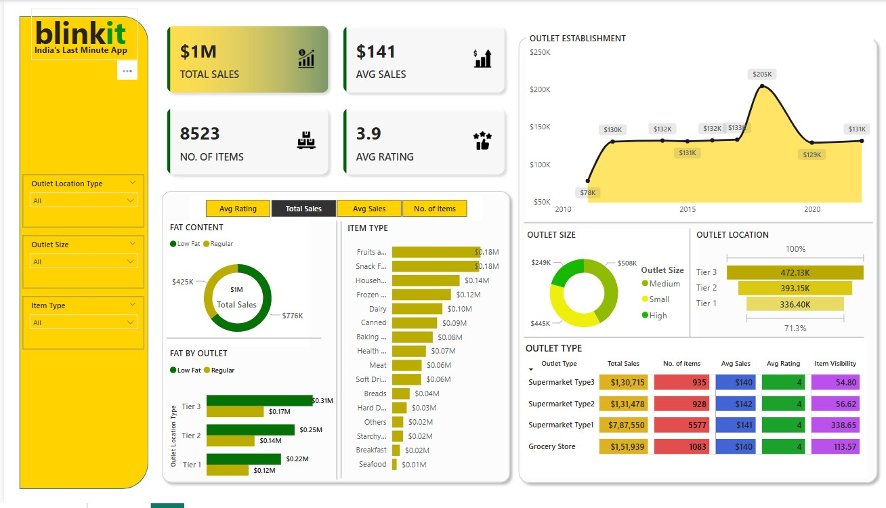

# 🛒 Blinkit E-Commerce Sales Dashboard (Power BI)

This Power BI dashboard analyzes sales data for Blinkit — India's last-minute grocery app.

## 📊 Features

- **Total Sales**: $1M+
- **Avg Sales**: $141 | **Avg Rating**: 3.9
- **No. of Items**: 8523
- **Filter by**: Item Type, Outlet Size, Location
- **Visuals**: Donut Charts, Bar Charts, Time Series Line Graphs, KPI Tiles
- **Insights**: Best performing outlet types, sales trends, fat content analysis, and more.

## 🖼️ Dashboard Preview

## 🔧 Tools Used

- Microsoft Power BI
- Data Modeling
- DAX & Power Query
- Data Cleaning and Transformation

## 📁 Files

- **blinkit-dashboard.pbix** – Power BI project file
- **BlinkIT Grocery Data.xlsx** – Dataset file

## 🧠 Learnings

- Hands-on experience with Power BI dashboarding
- KPI design and visualization best practices
- Handling real-world business scenarios

---

## License
This project is licensed under the MIT License.

> Feel free to clone or use for learning.  
> ©️ 2025 [Hema Malik]
